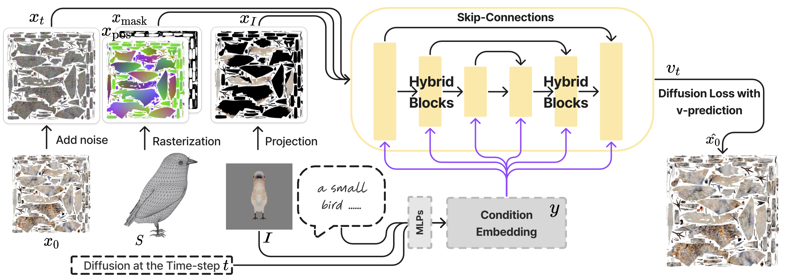

# TEXGen: a Generative Diffusion Model for Mesh Textures
The official PyTorch implementation of ***TEXGen***, a feed-forward texture generation model which diffuses albedo texture map directly on **UV domain**. The code is based on PyTorch Lightning. 

## Overview

**Input**:
1. **Model mesh**(UV coordinates, position map, mask map)
2. **A textural prompt**
3. **An image condition**
4. Denoise timestep t
5. Gaussian noise
   
**Output**:
1. Texture map

---
## Requirements
The training process requires at least one GPU with VRAM bigger than 40GB. We test the whole pipeline using Nvidia A100 gpu. Other GPUs are not tested but may be fine.

For testing only, a GPU with 24GB VRAM will be fine.

-----

## Preparation
### Environment
#### Docker Image
For convenience, it is welcomed to use our built-up docker image to run TEXGen.
```shell
docker run -it anonymous076/texgen_release bash 
```

#### From Scratch
> Note that it could be really tricky to build an environment from scratch, so we strongly recommend you to use our docker image.

You can also build your environment on your own.
```shell
# apt-get install libgl1 libglib2.0-0 libsm6 libxrender1 libxext6 libssl-dev build-essential g++ libboost-all-dev libsparsehash-dev git-core perl libegl1-mesa-dev libgl1-mesa-dev -y
conda create -n texgen python=3.10 -y
conda activate texgen
conda install ninja -y
conda install -c "nvidia/label/cuda-11.8.0" cuda-toolkit -y
conda install pytorch==2.1.0 torchvision==0.16.0 pytorch-cuda=11.8 -c pytorch -c nvidia -y
conda install h5py pyyaml -c anaconda -y
conda install sharedarray tensorboard tensorboardx yapf addict einops scipy plyfile termcolor timm gxx=11.1.0 lightning -c conda-forge -y
conda install pytorch-cluster pytorch-scatter pytorch-sparse -c pyg -y
pip install -r requirements.txt
```


### Data
We provide the testing data in `assets/models`. However, we are still preparing for the training data to release. You can organize your customized training data as below:
```shell
$YOUR_DATA_PATH
├── 34 # which is the first two character of the model id
│   └── 3441609f539b46b38e7ab1213660cf3e # the unique id of a 3D model
│       ├── model.mtl
│       ├── model.obj
│       └── model.png # albedo texture map
```
For the model indices input, see [assets/input_list/test_input.jsonl](assets/input_list/test_input.jsonl) for an example, where `result` represents the textual prompt.

### Model Checkpoint
You can download our [trained checkpoint](https://drive.google.com/file/d/1J0vUQsns-vxu7e0Rc6PpzkN5OzDWwPvu/view?usp=sharing), and put it under `assets/checkpoints`.


### Other Pretrained Models
During the whole process, some components (e.g. CLIP, time scheduler) from HuggingFace are required. So make sure you have the access to HF or to their checkpoints. The relevant components are listed here:
```text
lambdalabs/sd-image-variations-diffusers
stabilityai/stable-diffusion-2-depth
```

-----

## Usage
### Test
For sanity checking, you can run the following code snippet. 
```shell
CHECKPOINT_PATH="assets/checkpoints/pretrained.ckpt"
# assume single gpu
python launch.py --config configs/test.yaml \
    --test --gpu 0 \
    data.eval_scene_list="assets/input_list/test_input.jsonl" \
    exp_root_dir=outputs_test name=test tag=test \
    system.weights=$CHECKPOINT_PATH
```
If run successfully, the results will be put in `<exp_root_dir>/<name>/<tag>@<time>`. 
For example: 

```shell
outputs_test/test/test@20240828-194716
└── save
    └── it0-test
        ├── baked_texture
        │   └── 3521a5969e9e4b22813a88e2916db772.jpg # The image condition baked in UV domain
        ├── gt_x0
        │   └── 3521a5969e9e4b22813a88e2916db772.jpg # The ground-truth texture map
        ├── pred_x0
        │   ├── 3521a5969e9e4b22813a88e2916db772.jpg # The TEXGen predicted texture map
        │   ├── mask_3521a5969e9e4b22813a88e2916db772.jpg # Valid texture mask
        │   └── pos_3521a5969e9e4b22813a88e2916db772.jpg # Position map which uses corresponding XYZ coordinates to replace the RGB value
        ├── render_baked_texture
        │   ├── 3521a5969e9e4b22813a88e2916db772.jpg # Model rendering images with only the image condition
        │   └── condition_3521a5969e9e4b22813a88e2916db772.jpg # Image condition
        ├── render_gt_x0
        │   ├── 3521a5969e9e4b22813a88e2916db772.jpg # Model rendering images with ground-truth texture
        │   └── condition_3521a5969e9e4b22813a88e2916db772.jpg # Model rendering image with ground-truth texture using the same camera setting as the image condition
        └── render_pred_x0
            ├── 3521a5969e9e4b22813a88e2916db772.jpg # Rendered images using predicted texture
            └── condition_3521a5969e9e4b22813a88e2916db772.jpg # Model rendering image with predicted texture using the same camera setting as the image condition
```
### Train
An overfitting experiment setting, you can replace the input with your own data.

```shell
YOUR_INPUT_INDICES="assets/input_list/test_input.jsonl" # change this
NUMBER_OF_INPUT=`cat $YOUR_INPUT_INDICES | wc -l`
echo $YOUR_INPUT_INDICES $NUMBER_OF_INPUT

python launch.py --config ./configs/train.yaml \
    --train \
    --gpu 0 tag=overfit_on_6 data.repeat=100 \
    data.scene_list=$YOUR_INPUT_INDICES input_length=$NUMBER_OF_INPUT
    # --gpu 0,1,2,3,4,5,6,7 tag=train_n1_g8 \ # if use 8 gpus
```

---

## Other Tools
1. **Export to glb**: 
```shell
python tools/export_to_glb.py\
    --input_indices_path <YOUR_INPUT_INDICES_PATH> \
    --texture_exp_dir <YOUR_TEXTURE_EXP_DIR>\
    --output_glb_dir <YOUR_GLB_PATH>
```
2. **Render**:
```shell
python tools/render_all.py \
    --glb_path <YOUR_GLB_PATH> \
    --blender36_exec_path <YOUR_BLENDER3.6_EXEC_PATH>
```

-----

## Citation
```bib
Paper not released yet.
```